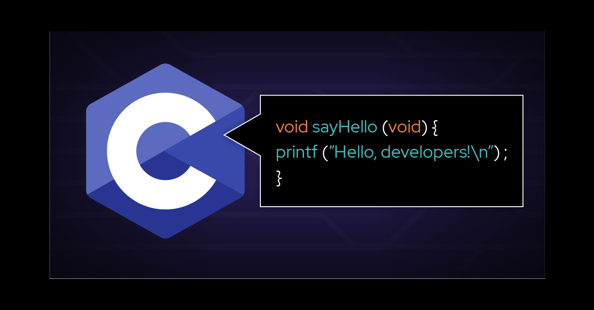

# printf holberton

Ce projet est une implémentation simplifiée de la fonction printf standard en C. Ce projet gère les spécificateurs de format de base tels que %c, %s, %d, %i, et %%.
Fonctionnalités
Gestion des spécificateurs suivants :
%c : Caractère
%s : Chaîne de caractères
%d et %i : Entiers
%% : Caractère pourcentage
Structure du Projet
Le projet se compose de plusieurs fichiers :
main.h : Fichier d'en-tête contenant les prototypes et structures
_printf.c : Implémentation principale de la fonction _printf
Fichiers auxiliaires contenant les fonctions d'impression spécifiques
Fonction Principale : _printf
c
int _printf(const char *format, ...);

Description
La fonction _printf produit une sortie formatée selon la chaîne de format spécifiée.
Paramètres
format : Chaîne de caractères contenant le texte à imprimer avec des spécificateurs de format optionnels
... : Arguments variables correspondant aux spécificateurs de format
Retour
Nombre total de caractères imprimés
Fonctions Auxiliaires
print_char
Imprime un seul caractère.
print_string
Imprime une chaîne de caractères.
print_percent
Imprime le caractère pourcentage.
print_int
Imprime un entier.
Compilation
Pour compiler le projet, utilisez :
text
gcc -Wall -Werror -Wextra -pedantic *.c -o printf

Utilisation
Incluez main.h dans votre programme et utilisez _printf comme vous le feriez avec printf.
Exemple :
c
#include "main.h"

int main(void)
{
    _printf("Hello, %s!\n", "world");
    return (0);
}

Auteurs
[Vos noms ici]
Note
Ce projet est une implémentation simplifiée et ne couvre pas toutes les fonctionnalités de la fonction printf standard.